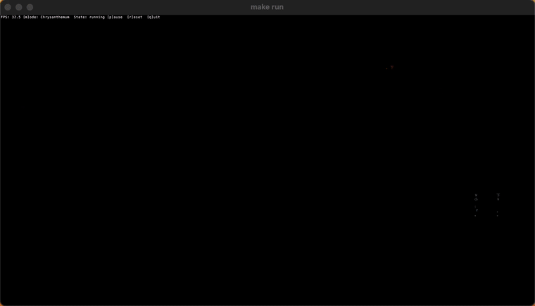

# Firework

A terminal Firework animation engine and ASCII art CLI written in Go, built with Charm's Bubble Tea and Lip Gloss TUI libraries.

## Demo



[Watch the demo on YouTube](https://youtu.be/D6vXbLvAlIM)

## Note on GPU-Accelerated Terminals

For the best animation experience, use a GPU-accelerated terminal emulator such as [Kitty](https://github.com/kovidgoyal/kitty), [Alacritty](https://github.com/alacritty/alacritty) or similar. While not required, these terminals can provide smoother and more vibrant visuals for the firework animation.

## Table of Contents

- [Requirements](#requirements)
- [Features](#features)
- [Usage](#usage)
- [Dependencies](#dependencies)
- [Project Structure](#project-structure)
- [How it Works](#how-it-works)
- [Contributions](#contributions)
- [License](#license)

## Requirements

- [Go 1.26+](https://go.dev/dl/)

## Features

- Real-time firework simulation reusing [firework-rs](https://github.com/Wayoung7/firework-rs) cjk charset and glimmering effect.
- Colorful, animated terminal output for modern terminal emulators.
- Performance-oriented particle engine.
- 30 FPS ASCII rendering up to 4K (3829x700 with [kitty](https://github.com/kovidgoyal/kitty) or [iTerm2](https://iterm2.com) on Apple M1/16GB).

## Usage

### Clone

```sh
git clone https://github.com/erik-adelbert/firework.git
cd firework
```

### Run with Makefile

```sh
make demo
```

or

```sh
make run
```

Build the executable:

```sh
make build
./bin/firework -h
```

### Install with go install

```sh
go install github.com/erik-adelbert/firework/cmd/firework@latest
```

### Test and benchmark

```sh
make test
make bench
```

### Run without Makefile

```sh
go run ./cmd/firework/main.go
```

Build a binary:

```sh
mkdir -p bin
go build -o bin/firework ./cmd/firework/main.go
./bin/firework -h
```

## Dependencies

- [Bubble Tea](https://github.com/charmbracelet/bubbletea)
- [Lip Gloss](https://github.com/charmbracelet/lipgloss)
- [Go terminal support](https://pkg.go.dev/golang.org/x/term)

## Project Structure

- `cmd/firework/` — CLI entry point (`main` package)
- `fireworks/` — Builtins fireworks
- `demos/` — Builtins shows
- `internal/` — Core simulation and rendering logic
- `tui/` — Charm's TUI application

## How it Works

- The model simulates fireworks as a simple physics-based particle system.

## Contributions

- Fork the project and open a pull request
- Contribute improvements, new fireworks, or show scripts

## License

MIT. See [LICENSE](LICENSE.TXT).

## Author

Erik Adelbert

Note: I don't need to vibe my code. This project is crafted.
